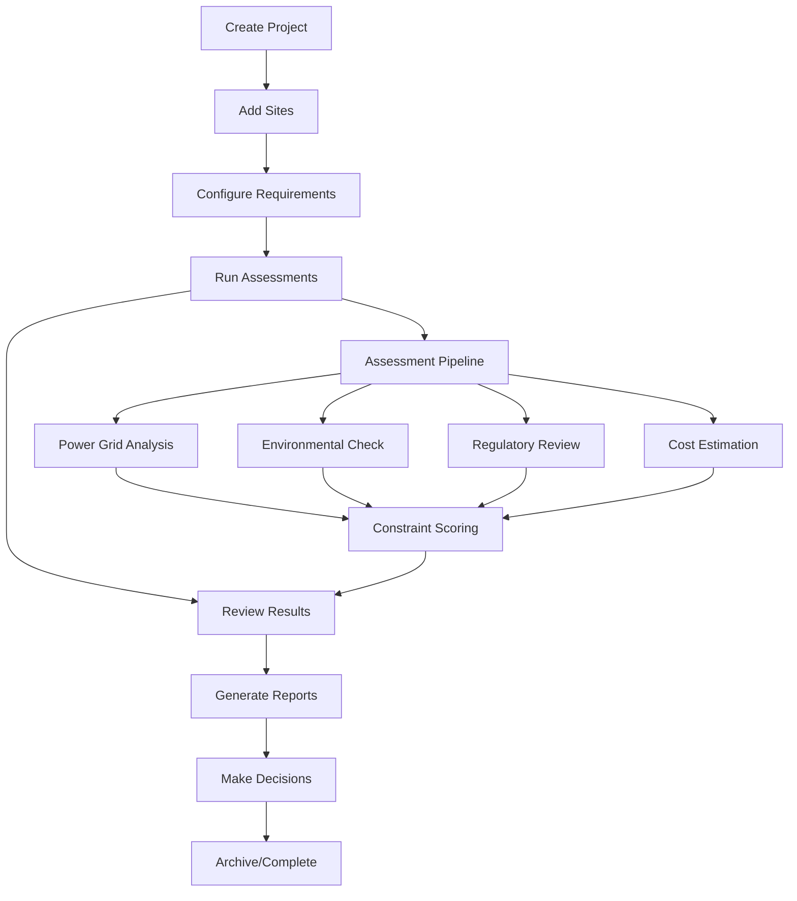

# Complete Project Lifecycle Plan
*End-to-End Datacenter Development Project Management*

## Overview
A comprehensive system for managing datacenter site assessment and development projects from initial concept through final development decision.

## Core Components Architecture

### 1. Database Foundation
**Status: ✅ Complete** - Schema exists in `core/database/schema.sql`

**Tables:**
- `organizations` - Client companies
- `users` - Team members with roles
- `projects` - Main project containers
- `sites` - Individual locations within projects
- `risk_assessments` - Detailed assessment data
- `data_sources` - Track data provenance
- `reports` - Generated outputs

### 2. Data Layer (Priority: HIGH)
**Status: 🔄 In Progress**

**API Routes Structure:**
```
/api/
├── projects/
│   ├── route.ts                 # GET /api/projects (list)
│   ├── [id]/
│   │   ├── route.ts            # GET/PUT/DELETE /api/projects/[id]
│   │   ├── sites/route.ts      # GET/POST /api/projects/[id]/sites
│   │   └── reports/route.ts    # GET/POST /api/projects/[id]/reports
├── sites/
│   ├── [id]/
│   │   ├── route.ts            # GET/PUT/DELETE /api/sites/[id]
│   │   ├── assess/route.ts     # POST /api/sites/[id]/assess
│   │   └── analysis/route.ts   # GET /api/sites/[id]/analysis
└── organizations/
    └── route.ts                # GET /api/organizations (current user's org)
```

**Database Operations:**
```typescript
// lib/database/
├── projects.ts         # Project CRUD operations
├── sites.ts           # Site CRUD operations  
├── assessments.ts     # Risk assessment operations
├── reports.ts         # Report generation operations
└── supabase.ts        # Client configuration
```

### 3. Project Workflow States
**Complete Lifecycle:**



**Project States:**
1. **Setup** - Initial project creation, team assignment
2. **Sites** - Adding/configuring site locations and requirements  
3. **Assessment** - Running automated and manual assessments
4. **Analysis** - Reviewing results, scoring, ranking sites
5. **Reporting** - Generating client deliverables
6. **Decision** - Final go/no-go recommendations
7. **Complete** - Project archived with outcomes

**Site States:**
1. **Draft** - Site added but not configured
2. **Ready** - Requirements set, ready for assessment
3. **Assessing** - Assessment pipeline running
4. **Reviewed** - Results available, needs human review
5. **Approved** - Recommended for development
6. **Rejected** - Not suitable for development
7. **On Hold** - Paused pending external factors

### 4. Assessment Pipeline
**Automated Data Collection:**
- Power grid infrastructure (Fingrid, ENTSO-E)
- Environmental constraints (SYKE, OpenStreetMap)
- Regulatory requirements (Municipal APIs)
- Infrastructure proximity (Roads, fiber, water)

**Analysis Components:**
- Distance calculations to critical infrastructure
- Capacity vs. requirement matching
- Environmental impact assessment
- Regulatory compliance checking
- Cost modeling and timeline estimation

**Scoring Algorithm:**
```typescript
interface SiteScore {
  overall: number;           // 0-10 composite score
  infrastructure: number;    // Power, fiber, transport access
  environmental: number;     // Protected areas, water access
  regulatory: number;        // Zoning, permits, approvals  
  technical: number;         // Soil, seismic, construction
  economic: number;          // Cost efficiency, ROI factors
}
```

### 5. UI Component Hierarchy
**Navigation Structure:**
```
App Layout
├── /projects                    # Project list dashboard
├── /projects/[id]              # Project detail view
│   ├── /overview               # Summary, progress, metrics
│   ├── /sites                  # Site management
│   │   ├── /[siteId]          # Individual site detail  
│   │   ├── /[siteId]/assess   # Assessment configuration
│   │   └── /[siteId]/results  # Assessment results
│   ├── /reports               # Report generation
│   └── /settings              # Project configuration
└── /admin                     # Organization management
```

**Component Architecture:**
```
components/
├── layout/
│   ├── AppLayout.tsx          # Main application shell
│   ├── ProjectLayout.tsx      # Project-specific layout
│   └── Navigation.tsx         # Main navigation
├── projects/
│   ├── ProjectList.tsx        # Project dashboard
│   ├── ProjectCard.tsx        # Individual project preview
│   ├── CreateProject.tsx      # Project creation modal
│   └── ProjectSettings.tsx    # Project configuration
├── sites/
│   ├── SiteList.tsx          # Sites within project
│   ├── SiteCard.tsx          # Individual site preview  
│   ├── SiteForm.tsx          # Add/edit site
│   ├── SiteMap.tsx           # Geographic visualization
│   └── SiteAssessment.tsx    # Assessment results
├── assessments/
│   ├── AssessmentForm.tsx    # Configure assessment
│   ├── AssessmentProgress.tsx # Real-time progress
│   ├── ConstraintList.tsx    # Constraint visualization
│   └── ScoreCard.tsx         # Score breakdown
├── reports/
│   ├── ReportGenerator.tsx   # Report configuration
│   ├── ReportPreview.tsx     # Preview before generation
│   └── ReportList.tsx        # Generated reports
└── common/
    ├── Map.tsx               # Reusable map component
    ├── DataTable.tsx         # Sortable/filterable tables
    ├── StatusBadge.tsx       # Status indicators
    ├── ProgressBar.tsx       # Progress visualization
    └── forms/                # Reusable form components
```

## Implementation Priority

### Phase 1: Foundation (Current Sprint)
**Objective: Working project and site management with database**

1. **Database Operations** (`lib/database/`)
   - Supabase client setup with proper types
   - Project CRUD operations
   - Site CRUD operations
   - Basic error handling and validation

2. **API Routes** (`app/api/`)  
   - Projects list/create/read/update/delete
   - Sites within projects CRUD
   - Proper error responses and validation

3. **Core UI Components**
   - Project list dashboard (replace current demo)
   - Project detail view with tabs
   - Site management within projects
   - Basic form components

### Phase 2: Assessment Pipeline (Next Sprint)
**Objective: Automated site assessment and scoring**

1. **Assessment Engine**
   - Data ingestion clients (Fingrid, OSM, etc.)
   - ETL processing and transformation
   - Constraint analysis and scoring
   - Results storage in database

2. **Assessment UI**
   - Assessment configuration forms
   - Real-time progress tracking
   - Results visualization
   - Constraint analysis display

### Phase 3: Reporting & Workflow (Future Sprint)
**Objective: Complete project lifecycle management**

1. **Report Generation**
   - PDF/Excel export functionality
   - Template system for client reports
   - Automated report scheduling

2. **Workflow Management**
   - Project status tracking
   - User assignment and notifications
   - Approval workflows
   - Audit trail

## Success Metrics

### Technical Metrics
- [ ] All database operations working with proper error handling
- [ ] Sub-1-second API response times for list operations  
- [ ] Sub-3-second assessment completion for single sites
- [ ] 99.5% uptime for assessment pipeline
- [ ] Zero data loss with proper backup/recovery

### User Experience Metrics
- [ ] Complete project creation in <2 minutes
- [ ] Site assessment completion in <5 minutes  
- [ ] Report generation in <30 seconds
- [ ] Intuitive navigation requiring no training
- [ ] Mobile-responsive design for field use

### Business Metrics
- [ ] Support 100+ concurrent projects per organization
- [ ] Handle 1000+ sites per project efficiently
- [ ] Generate client-ready reports automatically
- [ ] Reduce site assessment time from days to hours
- [ ] Provide audit trail for regulatory compliance

## Data Flow Example

### Complete Project Lifecycle
```
1. User creates project "Nordic Expansion 2025"
   └── POST /api/projects { name, country_code, description }
   └── Database: INSERT INTO projects 
   └── UI: Redirect to /projects/[id]/sites

2. User adds sites to project  
   └── POST /api/projects/[id]/sites { name, coordinates, requirements }
   └── Database: INSERT INTO sites
   └── UI: Show site in project site list

3. User triggers site assessments
   └── POST /api/sites/[id]/assess
   └── Assessment pipeline: Data collection → ETL → Scoring
   └── Database: INSERT INTO risk_assessments
   └── UI: Real-time progress updates

4. User reviews assessment results
   └── GET /api/sites/[id]/analysis  
   └── UI: Show constraint analysis, scoring, recommendations

5. User generates project report
   └── POST /api/projects/[id]/reports { type, format }
   └── Report generator: Compile data → Generate PDF/Excel
   └── Database: INSERT INTO reports
   └── UI: Download link provided

6. Project completion
   └── PUT /api/projects/[id] { status: 'completed' }
   └── Database: UPDATE projects SET status, updated_at
   └── UI: Project marked complete in dashboard
```

This creates a complete, auditable trail from initial project concept through final development recommendations.