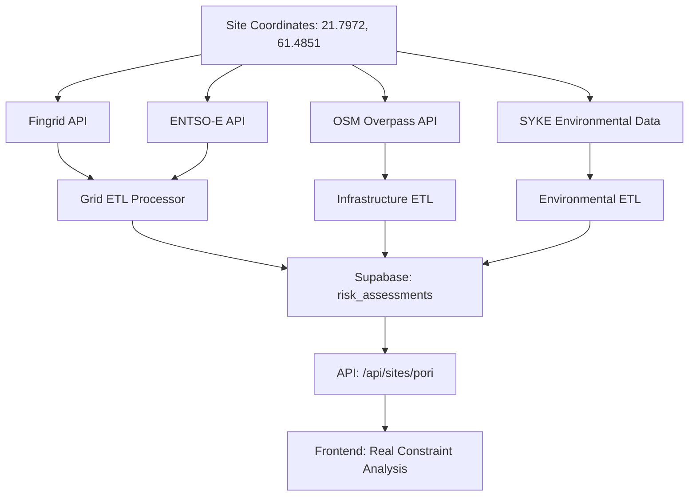

# Data Pipeline Architecture

## Current State Analysis
- ✅ Database schema exists (`core/database/schema.sql`) 
- ✅ Frontend visualization working with demo data
- ❌ No data ingestion from external sources
- ❌ No ETL processing pipeline
- ❌ Frontend still using hardcoded demo data

## Required Pipeline Components

### 1. Data Sources Integration
```
External APIs → Data Ingestion → ETL Processing → Supabase → Frontend
```

**Key Data Sources for Pori, Finland:**
- **Power Grid**: Fingrid API, ENTSO-E Transparency Platform
- **Environmental**: SYKE (Finnish Environment Institute), Natura 2000
- **Infrastructure**: OpenStreetMap Overpass API, Maanmittauslaitos
- **Regulatory**: Municipal WFS services, zoning data

### 2. Data Ingestion Layer (`/lib/data-pipeline/ingestion/`)
```typescript
/ingestion/
├── fingrid-client.ts      // Grid data from Fingrid
├── entso-e-client.ts      // European grid data
├── osm-client.ts          // Infrastructure from OpenStreetMap
├── environmental-client.ts // Protected areas, water resources
├── municipal-client.ts    // Local zoning, permits
└── base-client.ts         // Common API patterns
```

### 3. ETL Processing (`/lib/data-pipeline/etl/`)
```typescript
/etl/
├── transformers/
│   ├── grid-transformer.ts      // Power data → risk_assessments
│   ├── environmental-transformer.ts
│   └── infrastructure-transformer.ts
├── validators/
│   ├── data-validator.ts        // Quality checks
│   └── schema-validator.ts      // Database compatibility
└── processors/
    ├── site-processor.ts        // Main processing logic
    └── batch-processor.ts       // Bulk operations
```

### 4. Database Operations (`/lib/data-pipeline/database/`)
```typescript
/database/
├── site-operations.ts           // CRUD for sites table
├── risk-operations.ts           // risk_assessments operations
├── data-source-tracking.ts      // Track data provenance
└── migration-utils.ts           // Move from demo to real data
```

### 5. API Routes (`/app/api/`)
```typescript
/api/
├── sites/
│   ├── [id]/route.ts           // Get site with real data
│   └── route.ts                // List sites
├── assessments/
│   ├── [siteId]/route.ts       // Get full assessment
│   └── route.ts                // Trigger new assessment
└── pipeline/
    ├── ingest/route.ts         // Manual data refresh
    └── status/route.ts         // Pipeline health
```

### 6. Automation (`/lib/data-pipeline/automation/`)
```typescript
/automation/
├── scheduler.ts                 // Cron-like scheduling
├── refresh-jobs.ts             // Scheduled data updates
└── monitoring.ts               // Pipeline health checks
```

## Implementation Priority

### Phase 1: Foundation (Current Sprint)
1. Create data ingestion clients for key sources
2. Build basic ETL transformers  
3. Create API routes to serve real data
4. Replace demo data with database calls

### Phase 2: Automation
1. Scheduled data refresh
2. Error handling and retry logic
3. Data quality monitoring
4. Performance optimization

### Phase 3: Enhancement  
1. Real-time data streams
2. Advanced constraint modeling
3. Predictive analytics
4. Multi-country expansion

## Data Flow Example (Pori Site)



## Success Metrics
- ✅ Real constraint scores (not 0.0/10)
- ✅ Live infrastructure data
- ✅ Current environmental restrictions
- ✅ Up-to-date regulatory status
- ✅ Data source traceability
- ✅ Sub-1-second API response times